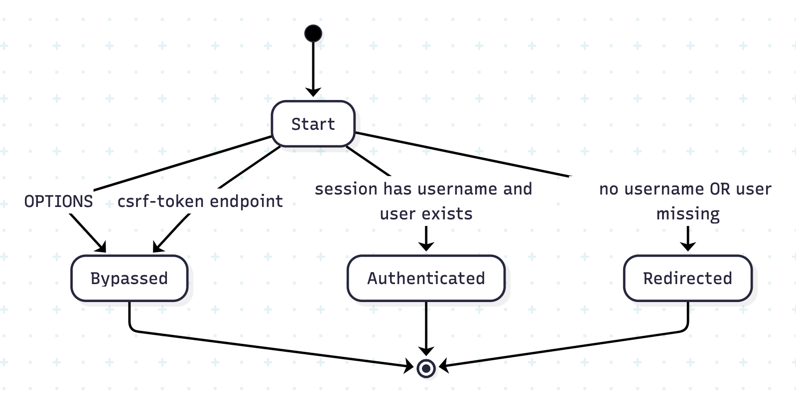

# Authentication Flow FSM Tests – Explanation Report

This document explains the design idea and test coverage of the authentication-related tests added to `rocketmq-dashboard`.  
We model and verify the behavior using a **Finite State Machine (FSM) perspective**.

The goal of these tests is to verify **authentication decision logic** and **request flow delegation**.

---

## 1. Conceptual Model: Finite State Machine (FSM)

Each incoming HTTP request goes through an authentication decision process.  
From a logical perspective, this process can be described as a **Finite State Machine** where:

- Each request starts from a **Start** state
- Based on request attributes and session data, it transitions into one of several terminal states

### States

| State | Meaning |
|------|--------|
| **Start** | Entry point of request handling |
| **Bypassed** | Authentication is skipped |
| **Authenticated** | User is verified and request is allowed |
| **Redirected** | Authentication fails and request is redirected to login |

---

## 2. Guards / Conditions

Transitions between states depend on the following guards:

| Guard | Description |
|-----|------------|
| `method == OPTIONS` | CORS preflight request |
| `URL contains /csrf-token` | CSRF token endpoint |
| `session has username AND user exists` | Valid logged-in user |
| `no session OR no username OR user missing` | Authentication failure |

---

## 3. State Transitions

| From State | Condition (Guard) | To State |
|----------|------------------|---------|
| Start | HTTP method is `OPTIONS` | Bypassed |
| Start | URL is CSRF token endpoint | Bypassed |
| Start | Session has username **and** user exists | Authenticated |
| Start | No session / no username / user missing | Redirected |

All terminal states (`Bypassed`, `Authenticated`, `Redirected`) end the request handling for that interceptor cycle.

---

## 4. FSM Test

- `LoginServiceImpl` tests validate **authentication decisions**: whether a request is allowed or redirected
- `AuthInterceptor` tests validate **request flow delegation**: when to bypass authentication and when to delegate to `LoginServiceImpl`

### Test Files (Paths)

- `src/test/java/org/apache/rocketmq/dashboard/service/impl/LoginServiceFsmTest.java`
- `src/test/java/org/apache/rocketmq/dashboard/interceptor/AuthInterceptorFsmTest.java`

### FSM States

- **S0 Start**: entering `AuthInterceptor.preHandle()` or `LoginServiceImpl.login()`
- **S1 Bypassed**: skip authentication and allow request
- **S2 Authenticated**: authentication passes and allow request
- **S3 Redirected**: authentication fails, redirect to login, block request

### Transition Rules (Guards)

- **G1**: `request.method == "OPTIONS"` → bypass
- **G2**: `request.url contains "/rocketmq-dashboard/csrf-token"` → bypass
- **G3**: `session exists` AND `session has username` AND `userContext.queryByUsername(username) != null` → authenticated
- **G4**: otherwise (no session / no username / user missing) → redirected

### LoginServiceFsmTest (`LoginServiceImpl.login(request, response)`)

1) `testLogin_SessionHasUser_UserExists_ReturnsTrue`  
- **Condition**: session ✅, username ✅, userInfo ✅ (G3)  
- **Transition**: `S0 Start → S2 Authenticated`  
- **Expected**: returns `true`, no redirect

2) `testLogin_UserMissing_RedirectsAndReturnsFalse`  
- **Condition**: session ✅, username ✅, userInfo ❌ (G4)  
- **Transition**: `S0 Start → S3 Redirected`  
- **Expected**: returns `false`, `sendRedirect(... "/#/login?redirect=" ...)`

3) `testLogin_NoSessionOrNoUsername_RedirectsAndReturnsFalse`  
- **Condition**: session ❌ (or username ❌) (G4)  
- **Transition**: `S0 Start → S3 Redirected`  
- **Expected**: returns `false`, `sendRedirect(... "/#/login?redirect=" ...)`

### AuthInterceptorFsmTest (`AuthInterceptor.preHandle(request, response, handler)`)

4) `testPreHandle_OPTIONS_Bypass`  
- **Condition**: method = OPTIONS (G1)  
- **Transition**: `S0 Start → S1 Bypassed`  
- **Expected**: returns `true`, **does not call** `loginService.login(...)`

5) `testPreHandle_CsrfToken_Bypass`  
- **Condition**: URL hits csrf-token endpoint (G2)  
- **Transition**: `S0 Start → S1 Bypassed`  
- **Expected**: returns `true`, **does not call** `loginService.login(...)`

6) `testPreHandle_NormalRequest_DelegatesToLoginService`  
- **Condition**: normal request (not G1/G2) → decision delegated to `loginService.login()`  
- **Transitions**:
  - if `loginService.login(...) == true` → `S0 Start → S2 Authenticated`
  - if `loginService.login(...) == false` → `S0 Start → S3 Redirected`
- **Expected**: `preHandle()` return value **matches** `loginService.login()` result

### Notes on “Why Two Test Files?”

- `LoginServiceFsmTest` validates the **core auth decision** (S0→S2 / S0→S3).
- `AuthInterceptorFsmTest` validates the **entry routing + bypass rules** (S0→S1) and **delegation** to `LoginServiceImpl.login()`.
- Together they cover the whole request-time authentication FSM:
  - Interceptor decides **bypass vs delegate**
  - LoginService decides **authenticated vs redirected**
